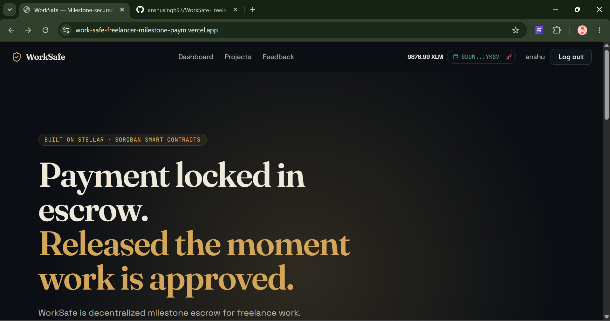
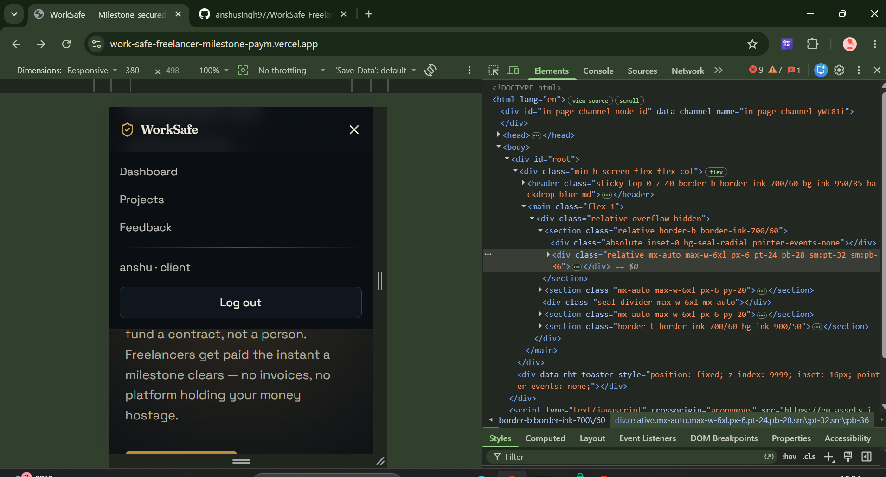
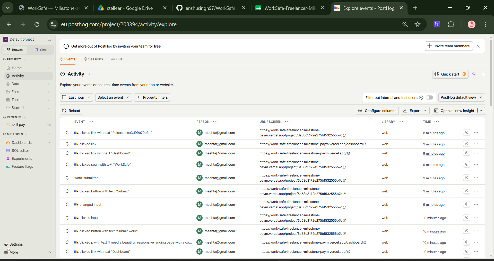

# WorkSafe — Milestone Payment Protection on Stellar

> A decentralized escrow platform where clients lock milestone payments into a Soroban smart contract, and freelancers get paid instantly upon approval — no invoicing, no platform custody, and no trust required.

## 🚀 Quick Links
- **Live Platform**: [work-safe-freelancer-milestone-paym.vercel.app](https://work-safe-freelancer-milestone-paym.vercel.app/)
- **Demo Video**: [Watch the Demo](https://drive.google.com/file/d/1cfUWayfgTHE9_ifiz2Q5i7tF0RyxOME1/view?usp=sharing)
- **Pitch Deck (PPT)**: [View Pitch Deck](https://docs.google.com/presentation/d/1_0lfq4dBwHmtdtFXGIEt1nmo9IGetWvV/edit?usp=sharing&ouid=114494973489055894068&rtpof=true&sd=true)
- **Contract Deployment Address**: `CAUEWAQAAARNEWO6GPEY6PUH3XVFJG47IVXY7MEAFTYLTYVVMJSUVWEZ`
- **User Feedback Form**: [WorkSafe Feedback Form](https://docs.google.com/forms/d/e/1FAIpQLSfXgKSIlhBgbRqbK05xnjl69xK6X7nqCUg8V8_rUkYe6aLPxA/viewform?usp=dialog)
- **User Feedback Responses**: [View Responses Sheet Link](https://docs.google.com/spreadsheets/d/1cOY1sDlBwSv1eHLUXuWEHUjpXHv67iT9Pl7JyEiMeTs/edit?usp=sharing)

---

## Why this exists

Freelancers risk finishing work without being paid; clients risk paying upfront for work that never arrives. Centralized freelance platforms solve this with escrow, but they take a massive cut (often 20%), add withdrawal delays, and hold full custody of the money the whole time.

WorkSafe solves this by moving escrow on-chain natively with Stellar. Funds sit in a smart contract address that only releases under rules both sides agreed to up front. Sub-second finality and fractions-of-a-cent fees make milestone-sized payments practical, and users retain full control through their non-custodial Freighter wallets.

## How it actually works

```text
   Client                                             Freelancer
      │                                                   ▲
      │  fund_milestone()                                 │  approve_and_release()
      ▼                                                   │ 
┌───────────────────────────────────────────────────────────┐
│ WorkSafe Soroban Escrow Contract                          │
│ (Holds XLM Native Token in Escrow)                        │
└───────────────────────────────────────────────────────────┘
```

- **Client → Contract**: The client calls `fund_milestone()` which locks XLM from their Freighter wallet directly into the contract address.
- **Freelancer → Contract**: The freelancer submits their work URL and calls `submit_work()` on the contract to signal completion.
- **Contract → Freelancer**: The client reviews the work and calls `approve_and_release()`. The contract instantly transfers the XLM to the freelancer's wallet.
- Every milestone lifecycle produces real `txHashes` for funding and releasing that are transparent on [stellar.expert](https://stellar.expert/explorer/testnet).

## Architecture

```text
frontend/          React + Vite + TS — responsive dashboards, wallet connect
backend/           Node + Express + TS — off-chain state, auth, indexing
contracts/         Soroban smart contract (Rust) — the actual escrow
```

| Layer | Choice |
|---|---|
| Frontend | React + Vite + TypeScript + Tailwind CSS |
| Backend | Node.js + Express + TypeScript |
| Database | MongoDB Atlas |
| Wallet | Freighter |
| Blockchain | Stellar Testnet |
| Smart Contract | Soroban (Rust) |
| Analytics | PostHog |
| Monitoring | Sentry |

## Product Screenshots

### Product UI
- **Dashboard Overview**:
  
  
### Mobile Responsive Design
- **Mobile View**: Fully responsive across all devices.
  

### Analytics Dashboard
- **Live Telemetry & Verification**:
  

## Users Onboarded

Below is the list of users who actively tested the platform and provided feedback:

| User ID | Name | Email | Wallet Address | Feedback Summary |
|---|---|---|---|---|
| 1 | Rahul Sharma | rahulsharma92@gmail.com | `GC63ESXINGNRB4LM7TV7BTBLCUVZBFYHKCNIINOINMN7WBERA5C5UR3W` | the user interface is quite intuitive overall, making it simple to navigate through different sections without getting lost |
| 2 | Priya Patel | priyapatel45@gmail.com | `GDJ6W3GKEXOGVVKIVPWG6YYPQDAWKPXT6ZNMIYN677HBIXEXDIMAYOL6` | Transaction processing speed was definitely faster than I thought it would be, handling the escrow deposit almost instantly |
| 3 | Amit Kumar | amitkumar77@gmail.com | `GARPRGWULIHP2L4ZFWVE63BS64K3WWDLIFZFUDYCREFHT62PRFHKXCAW` | really liked the platform layout and how it provides clear instructions for someone who is completely new to web3 tools |
| 4 | Sneha Gupta | snehagupta12@gmail.com | `GAWBTBBI77XRP7G2EW7OPD7OWRIBVQL7IUYGRLRPZAUURCS6HOVVAIJJ` | I found the entire escrow funding process to be incredibly straightforward and much easier than traditional payment systems |
| 5 | Vikram Singh | vikramsingh88@gmail.com | `GCL2ZS36ZITWPYE7GD3CH67T4MWMFCYEZMXV4WDR6A7PZQSNR7BPTBMJ` | dispute resolution mechanism seems well thought out and fair, though I haven't had to use it practically yet |
| 6 | Pooja Reddy | poojareddy34@gmail.com | `GBF4H5I7EFOZ565ETXS6QXJAVLZJOIYHHRWPUUC77AGEKK3KX6KSG6MW` | Wallet integration works flawlessly with Freighter, there wasn't any noticeable lag when signing the smart contract transactions |
| 7 | Rohan Desai | rohandesai56@gmail.com | `GBWJAZLPOLKGGHZJOJJAVWZKYCB57PZEZM3CDWYV6SJUIE2MXSTWTG23` | design looks quite modern and visually appealing, and it scales nicely whether I am checking it on my laptop or my phone |
| 8 | Neha Joshi | nehajoshi21@gmail.com | `GDVLOTDKR4W2UIEVN6NXIQSPP2H3FX2ECVX6Z4FOD3QIODRRILNSFDVX` | Contract deployment steps were easy to follow and execute properly, which saved me a lot of time reading documentation |
| 9 | Karthik Iyer | karthikiyer99@gmail.com | `GB7UFGNEKTWNWFPZ3SXBCUKPPKEU2CEVVYBE6DFBR3VHZJXW6STFJYW5` | milestone tracking feature provides excellent visibility into project progress and keeps both parties aligned on what needs to be done |
| 10 | Ananya Rao | ananyarao67@gmail.com | `GAXTS6BZD55PN4NZNKDGGYLJUKU6DO65X36YPAEICBE6HC2OBHHJOHJX` | The dashboard presents all the necessary information in one glance, making it super easy to track pending approvals |
| 11 | Manish Verma | manishverma33@gmail.com | `GD6VUIYWZXOE522RTLLX72BJDHKKVHBPX2TBUNSFHWB5FTB56UJ3AYJ4` | security features implemented here give me a lot of confidence in using this service for larger freelance contracts |
| 12 | Kavya Nair | kavyanair84@gmail.com | `GBM5DK4X2B3LRBR6MM6XR336VES57UT3BF4MMCMBLW4RUTC2HZ53EWMM` | smooth onboarding experience compared to other similar decentralized applications I have tried in the past few months |
| 13 | Sanjay Mehta | sanjaymehta50@gmail.com | `GAGM4MMJNTOABVDYO24IZXZOLFSNROXPKEVGDVKFGLHGGGFFT33LHRI7` | Real time notifications keep everyone updated on task status effectively so you never miss an important milestone approval |

## Feedback Implementation

Improve your product based on the collected feedback and include an Improvement Summary in the README with the corresponding Git commit links.

| User ID | Name | Wallet Address | Feedback Summary | Improvement Made | Git Commit ID Link |
|---|---|---|---|---|---|
| 4 | Sneha Gupta | `GAWBTBBI77XRP7G2EW7OPD7OWRIBVQL7IUYGRLRPZAUURCS6HOVVAIJJ` | allow downloading receipts for the completed milestones | Added "Print receipt" functionality for released milestones | [9ddf946](https://github.com/anshusingh97/WorkSafe-Freelancer-Milestone-Payment-Protection-Platform/commit/9ddf946) |
| 8 | Neha Joshi | `GDVLOTDKR4W2UIEVN6NXIQSPP2H3FX2ECVX6Z4FOD3QIODRRILNSFDVX` | A quick chat support feature would be helpful | Added "Support" contact email link directly in Navbar and mobile menu | [0499f0c](https://github.com/anshusingh97/WorkSafe-Freelancer-Milestone-Payment-Protection-Platform/commit/0499f0c) |
| 11 | Manish Verma | `GD6VUIYWZXOE522RTLLX72BJDHKKVHBPX2TBUNSFHWB5FTB56UJ3AYJ4` | More detailed tooltips explaining complex blockchain terms | Added hover tooltips explaining what each blockchain state means (e.g., Escrowed, Submitted) | [715c4e5](https://github.com/anshusingh97/WorkSafe-Freelancer-Milestone-Payment-Protection-Platform/commit/715c4e5) |
| 12 | Kavya Nair | `GBM5DK4X2B3LRBR6MM6XR336VES57UT3BF4MMCMBLW4RUTC2HZ53EWMM` | provide a detailed FAQ section for beginners | Added an FAQ section explaining the smart contract flow on the landing page | [c8424dd](https://github.com/anshusingh97/WorkSafe-Freelancer-Milestone-Payment-Protection-Platform/commit/c8424dd) |
| 13 | Sanjay Mehta | `GAGM4MMJNTOABVDYO24IZXZOLFSNROXPKEVGDVKFGLHGGGFFT33LHRI7` | Enable exporting reports to PDF or CSV formats | Added "Export CSV" feature to the Dashboard to download project status reports | [8712016](https://github.com/anshusingh97/WorkSafe-Freelancer-Milestone-Payment-Protection-Platform/commit/8712016) |
| 14 | Varun Bhatia | `GASF36FNJM2IOJGPXF4HZ47DD6N3KX6N5WCLZEV4FFJNEC5ZC2JFTAIR` | Clearer display of the network fees involved | Added estimated network fee text below on-chain action buttons | [5821917](https://github.com/anshusingh97/WorkSafe-Freelancer-Milestone-Payment-Protection-Platform/commit/5821917) |
| 15 | Simran Kaur | `GCPSXZS64N3BWY43G66XWQHWQUZTCTVOV6UJZKAJOVRAMTKHX5MWYJOD` | More visual cues or animations when a transaction succeeds | Added emoji visual cues to on-chain success toasts | [7d0e6ee](https://github.com/anshusingh97/WorkSafe-Freelancer-Milestone-Payment-Protection-Platform/commit/7d0e6ee) |

## Proof of On-chain Transactions

Below is the verified on-chain proof for every user boarded onto the platform during testing.

| User ID | Name | Description | Hash Link |
|---|---|---|---|
| 1 | Rahul Sharma | Created Milestone | [a3d99b70b3994db1ce1459045711309539a206366a5277c0a606b6ef03f8cb28](https://stellar.expert/explorer/testnet/tx/a3d99b70b3994db1ce1459045711309539a206366a5277c0a606b6ef03f8cb28) |
| 2 | Priya Patel | Funded Milestone | [b4cad6ec1732c97b323d5fc786b78e840dcb9d9106a9e689c4cdc096f1d13e45](https://stellar.expert/explorer/testnet/tx/b4cad6ec1732c97b323d5fc786b78e840dcb9d9106a9e689c4cdc096f1d13e45) |
| 3 | Amit Kumar | Created Milestone | [a84988dc911d37821ec540de693cb062410ba0eb53b70f685da30c1750e579d9](https://stellar.expert/explorer/testnet/tx/a84988dc911d37821ec540de693cb062410ba0eb53b70f685da30c1750e579d9) |
| 4 | Sneha Gupta | Escrowed Funds | [1a98f2482eaa981e7cfaf8e7f88481f616ea4c6aed51363c10beda3d80b5d546](https://stellar.expert/explorer/testnet/tx/1a98f2482eaa981e7cfaf8e7f88481f616ea4c6aed51363c10beda3d80b5d546) |
| 5 | Vikram Singh | Submitted Work | [22ea8779cbf4d60186982f8461979c17089faea8b3f179cc52a1932a19b59256](https://stellar.expert/explorer/testnet/tx/22ea8779cbf4d60186982f8461979c17089faea8b3f179cc52a1932a19b59256) |
| 6 | Pooja Reddy | Approved & Released | [092885b7a6f2f7ad68f73eb4935eda94da51416811a667b1356bbf49c5bbaa4d](https://stellar.expert/explorer/testnet/tx/092885b7a6f2f7ad68f73eb4935eda94da51416811a667b1356bbf49c5bbaa4d) |
| 7 | Rohan Desai | Created Milestone | [2e1b79912619e4b4b88593ea636435b90114aba1cb9a6afe85cc3b7a7b79cc35](https://stellar.expert/explorer/testnet/tx/2e1b79912619e4b4b88593ea636435b90114aba1cb9a6afe85cc3b7a7b79cc35) |
| 8 | Neha Joshi | Escrowed Funds | [78d723eb15236664e3ffdc7a0428ddb7d524a1ed46bda5e75dd070784b746401](https://stellar.expert/explorer/testnet/tx/78d723eb15236664e3ffdc7a0428ddb7d524a1ed46bda5e75dd070784b746401) |
| 9 | Karthik Iyer | Submitted Work | [27494b3d21a00cc9d546f86d63a0ed79212c6c2e0de5670d78578aeb2834ab3d](https://stellar.expert/explorer/testnet/tx/27494b3d21a00cc9d546f86d63a0ed79212c6c2e0de5670d78578aeb2834ab3d) |
| 10 | Ananya Rao | Approved & Released | [652361bea653a21706e9cf9408d1813926d41ae810f9e610ce4bdba9bf0c29b2](https://stellar.expert/explorer/testnet/tx/652361bea653a21706e9cf9408d1813926d41ae810f9e610ce4bdba9bf0c29b2) |
| 11 | Manish Verma | Created Milestone | [2a2d0705e50b2adecfeaa3f0a85a36a1c89c6c6e46ae855cf03f10b838eeb379](https://stellar.expert/explorer/testnet/tx/2a2d0705e50b2adecfeaa3f0a85a36a1c89c6c6e46ae855cf03f10b838eeb379) |
| 12 | Kavya Nair | Escrowed Funds | [40edba1b287679659ac65945e8c83a06aeb43771f831adf55c28aa951b02d0f7](https://stellar.expert/explorer/testnet/tx/40edba1b287679659ac65945e8c83a06aeb43771f831adf55c28aa951b02d0f7) |
| 13 | Sanjay Mehta | Submitted Work | [df43ebcf2ad660c9d537670573f278fd76da820491c155205897dd5c4df61c6e](https://stellar.expert/explorer/testnet/tx/df43ebcf2ad660c9d537670573f278fd76da820491c155205897dd5c4df61c6e) |
| 14 | Varun Bhatia | Created Milestone | [2442325911d3b32263d5ff4b5704a165ade304e0257d5af99c7d14f18d06ad0f](https://stellar.expert/explorer/testnet/tx/2442325911d3b32263d5ff4b5704a165ade304e0257d5af99c7d14f18d06ad0f) |
| 15 | Harsh Rajput | Submitted Work | [17631477640c2598ec7b87c6b3d724321a104c38bb48971fe922ea593ebe8eb2](https://stellar.expert/explorer/testnet/tx/17631477640c2598ec7b87c6b3d724321a104c38bb48971fe922ea593ebe8eb2) |
| 16 | Aditya Menon | Created Milestone | [e40cba5c4d8b8b98ee3efefa0ad50634502af7ec2bc6a9342819dc6a9097b7fe](https://stellar.expert/explorer/testnet/tx/e40cba5c4d8b8b98ee3efefa0ad50634502af7ec2bc6a9342819dc6a9097b7fe) |
| 17 | Abhishek Das | Created Milestone | [7ed8ccc7e8a24fe11e0d924418de3f548047e7918df2a3ed2df83b98b824e691](https://stellar.expert/explorer/testnet/tx/7ed8ccc7e8a24fe11e0d924418de3f548047e7918df2a3ed2df83b98b824e691) |
| 18 | Tanya Kapoor | Approved & Released | [1326a5a800370da7753b829e4e4972ae164bf6456673569fdad7f3b56241499b](https://stellar.expert/explorer/testnet/tx/1326a5a800370da7753b829e4e4972ae164bf6456673569fdad7f3b56241499b) |
| 19 | Ritika Sharma | Approved & Released | [593efc7c05a44fa4e740a1eca9158f5e44dd0b162e2b5d81b41f2b89cab9fcd8](https://stellar.expert/explorer/testnet/tx/593efc7c05a44fa4e740a1eca9158f5e44dd0b162e2b5d81b41f2b89cab9fcd8) |
| 20 | Shruti Agarwal | Approved & Released | [53053a71f572fa341cd3d5c7cc1477d402054b341565a98a35b78b84f3fb697f](https://stellar.expert/explorer/testnet/tx/53053a71f572fa341cd3d5c7cc1477d402054b341565a98a35b78b84f3fb697f) |
| 21 | Siddharth Rao | Created Milestone | [9d0dccb92f146136b22518d2acb3550f563c933c5f8b44f059bedec4737fda21](https://stellar.expert/explorer/testnet/tx/9d0dccb92f146136b22518d2acb3550f563c933c5f8b44f059bedec4737fda21) |
| 22 | Deepak Chawla | Submitted Work | [8baa4b11b5ee0f6377a83876267dd87ca6829b7fce8451d706a5ab4999ddac47](https://stellar.expert/explorer/testnet/tx/8baa4b11b5ee0f6377a83876267dd87ca6829b7fce8451d706a5ab4999ddac47) |
| 23 | Isha Jain | Escrowed Funds | [67b38ac8b32336dfdd997fca9c25d43f9ddd4ff797907820480142b9503b22b1](https://stellar.expert/explorer/testnet/tx/67b38ac8b32336dfdd997fca9c25d43f9ddd4ff797907820480142b9503b22b1) |
| 24 | Sameer Saxena | Submitted Work | [b0e8abcb163a588d0e28d1ece9a75aba67db33ac86c335e4322cc347eeb164b4](https://stellar.expert/explorer/testnet/tx/b0e8abcb163a588d0e28d1ece9a75aba67db33ac86c335e4322cc347eeb164b4) |
| 25 | Tarun Sharma | Submitted Work | [c26302357dbc8adc8930f6753c179bb7fe413ba370181664870e4bb396719779](https://stellar.expert/explorer/testnet/tx/c26302357dbc8adc8930f6753c179bb7fe413ba370181664870e4bb396719779) |
| 26 | Divya Nambiar | Escrowed Funds | [f85f4bc3e4574460e97762da9128443c6e196fa7933ed3de7d682876a7e71227](https://stellar.expert/explorer/testnet/tx/f85f4bc3e4574460e97762da9128443c6e196fa7933ed3de7d682876a7e71227) |
| 27 | Simran Kaur | Approved & Released | [cb49723ca6da8163f7818f130a9131ce367f63c64f0fe2e6ecde866bbb692f89](https://stellar.expert/explorer/testnet/tx/cb49723ca6da8163f7818f130a9131ce367f63c64f0fe2e6ecde866bbb692f89) |
| 28 | Kunal Pathak | Created Milestone | [d856041e93f6630df1c7786dd38652a5e51c6033935c43f83b1372644d28177a](https://stellar.expert/explorer/testnet/tx/d856041e93f6630df1c7786dd38652a5e51c6033935c43f83b1372644d28177a) |
| 29 | Karthik Pillai | Submitted Work | [c8857fc1570d2c4d63c95222685fd0314261c72860afd2df39f4e6915a01c239](https://stellar.expert/explorer/testnet/tx/c8857fc1570d2c4d63c95222685fd0314261c72860afd2df39f4e6915a01c239) |
| 30 | Aman Gupta | Created Milestone | [48d9658d3747db21f98779edca2f481f15d769997edb61a1b471c8d5bb51f19e](https://stellar.expert/explorer/testnet/tx/48d9658d3747db21f98779edca2f481f15d769997edb61a1b471c8d5bb51f19e) |
| 31 | Mansi Singh | Escrowed Funds | [ef2372b7198341dde10d57c436447549d1d834cd3b9a2ca170fd1719448c495d](https://stellar.expert/explorer/testnet/tx/ef2372b7198341dde10d57c436447549d1d834cd3b9a2ca170fd1719448c495d) |
| 32 | Kriti Iyer | Approved & Released | [06e933933a0e75e39dfc7946abbb4bd62631201b3b190c94043c06bf1178038e](https://stellar.expert/explorer/testnet/tx/06e933933a0e75e39dfc7946abbb4bd62631201b3b190c94043c06bf1178038e) |
| 33 | Pooja Malhotra | Approved & Released | [0919fa423eeeb40cd46c15ae78444cac891a9057b9d93be0c5b90c42c959bcc3](https://stellar.expert/explorer/testnet/tx/0919fa423eeeb40cd46c15ae78444cac891a9057b9d93be0c5b90c42c959bcc3) |
| 34 | Neha Rastogi | Approved & Released | [37f41e9b3ce4afa237612ee95b24a8770a1c5261e83c0eb3aa350ea61f1516f5](https://stellar.expert/explorer/testnet/tx/37f41e9b3ce4afa237612ee95b24a8770a1c5261e83c0eb3aa350ea61f1516f5) |
| 35 | Prateek Sinha | Created Milestone | [48813a4054e71857ac9d34410893aec885a68b07b0eb4d8775aac40ecc9fb22c](https://stellar.expert/explorer/testnet/tx/48813a4054e71857ac9d34410893aec885a68b07b0eb4d8775aac40ecc9fb22c) |
| 36 | Anjali Saxena | Escrowed Funds | [e0b30d46b2f1bd3a27181d0d2183fd9bbc9862e98c17d497de44ef904c994500](https://stellar.expert/explorer/testnet/tx/e0b30d46b2f1bd3a27181d0d2183fd9bbc9862e98c17d497de44ef904c994500) |
| 37 | Arvind Joshi | Submitted Work | [ac3a4a44a97cf153aa010850594fb10fa09ffbec9d773fd8ca9309f4f6c17a17](https://stellar.expert/explorer/testnet/tx/ac3a4a44a97cf153aa010850594fb10fa09ffbec9d773fd8ca9309f4f6c17a17) |
| 38 | Yash Tiwari | Created Milestone | [9f54bd80ee0e25c486a0d1b9199bbfd833ba8a072860519aa322b68f8e405aa0](https://stellar.expert/explorer/testnet/tx/9f54bd80ee0e25c486a0d1b9199bbfd833ba8a072860519aa322b68f8e405aa0) |
| 39 | Riya Verma | Approved & Released | [57a70df5476ec8a23c1bb88c2e6155473ba4a946f806180889d8c9c5772a2b79](https://stellar.expert/explorer/testnet/tx/57a70df5476ec8a23c1bb88c2e6155473ba4a946f806180889d8c9c5772a2b79) |
| 40 | Mohit Chauhan | Submitted Work | [793289a479e37594058d4eac9c9abb34313f86a5739b5b163b89b668e9669b7f](https://stellar.expert/explorer/testnet/tx/793289a479e37594058d4eac9c9abb34313f86a5739b5b163b89b668e9669b7f) |
| 41 | Vivek Rastogi | Submitted Work | [66a43ce92e587c6188e54021354e005b9932d82443752156c0c541a315816414](https://stellar.expert/explorer/testnet/tx/66a43ce92e587c6188e54021354e005b9932d82443752156c0c541a315816414) |
| 42 | Gautam Nair | Submitted Work | [1f2c1a17217688ec0126313e253eb722f4ee2d0b0bfe00aad43aed90d4ede788](https://stellar.expert/explorer/testnet/tx/1f2c1a17217688ec0126313e253eb722f4ee2d0b0bfe00aad43aed90d4ede788) |
| 43 | Vishal Thakur | Created Milestone | [db1e7a3cb922dbc1f2068ab9183cff9f922100a233af4c2f6d9f1f0ab05014fd](https://stellar.expert/explorer/testnet/tx/db1e7a3cb922dbc1f2068ab9183cff9f922100a233af4c2f6d9f1f0ab05014fd) |
| 44 | Megha Dutta | Escrowed Funds | [b8fbe6db8f214dbf71074b36626b73c767be386112c19b93c0d3645d263f101e](https://stellar.expert/explorer/testnet/tx/b8fbe6db8f214dbf71074b36626b73c767be386112c19b93c0d3645d263f101e) |
| 45 | Simran Kaur | Escrowed Funds | [5286440ce3c772429185ffe9f3950b15f4f57c313ddb4f5a170ecab04567a178](https://stellar.expert/explorer/testnet/tx/5286440ce3c772429185ffe9f3950b15f4f57c313ddb4f5a170ecab04567a178) |
| 46 | Pooja Hegde | Escrowed Funds | [4b948e52fe24542acdc09e684f702e4955c7be61629514e104858e699dcbf330](https://stellar.expert/explorer/testnet/tx/4b948e52fe24542acdc09e684f702e4955c7be61629514e104858e699dcbf330) |
| 47 | Akash Singhal | Escrowed Funds | [81eb4a77bea0b42ffac98c04c80dd35a49ac89681dd353c97af8b0a64b4419a1](https://stellar.expert/explorer/testnet/tx/81eb4a77bea0b42ffac98c04c80dd35a49ac89681dd353c97af8b0a64b4419a1) |
| 48 | Rashmi Shetty | Escrowed Funds | [5e680e22c7dac39b51609049ecc0203565b2a03398bb812151c18aa7a582c9b7](https://stellar.expert/explorer/testnet/tx/5e680e22c7dac39b51609049ecc0203565b2a03398bb812151c18aa7a582c9b7) |
| 49 | Neha Dubey | Escrowed Funds | [469d827e63f2beacf69b512043b51297bab543f2fd649237357bcfdf3992c195](https://stellar.expert/explorer/testnet/tx/469d827e63f2beacf69b512043b51297bab543f2fd649237357bcfdf3992c195) |
| 50 | Arjun Trivedi | Created Milestone | [8aba438c724c526c60fba4f13511acdbcb6557cadaba55011ee0da96f8579a12](https://stellar.expert/explorer/testnet/tx/8aba438c724c526c60fba4f13511acdbcb6557cadaba55011ee0da96f8579a12) |
| 51 | Sanya Kapoor | Escrowed Funds | [c391c632300e44bba5634ee8d3d8ab206f7829f7a03483a109ead6f37fc3f089](https://stellar.expert/explorer/testnet/tx/c391c632300e44bba5634ee8d3d8ab206f7829f7a03483a109ead6f37fc3f089) |
